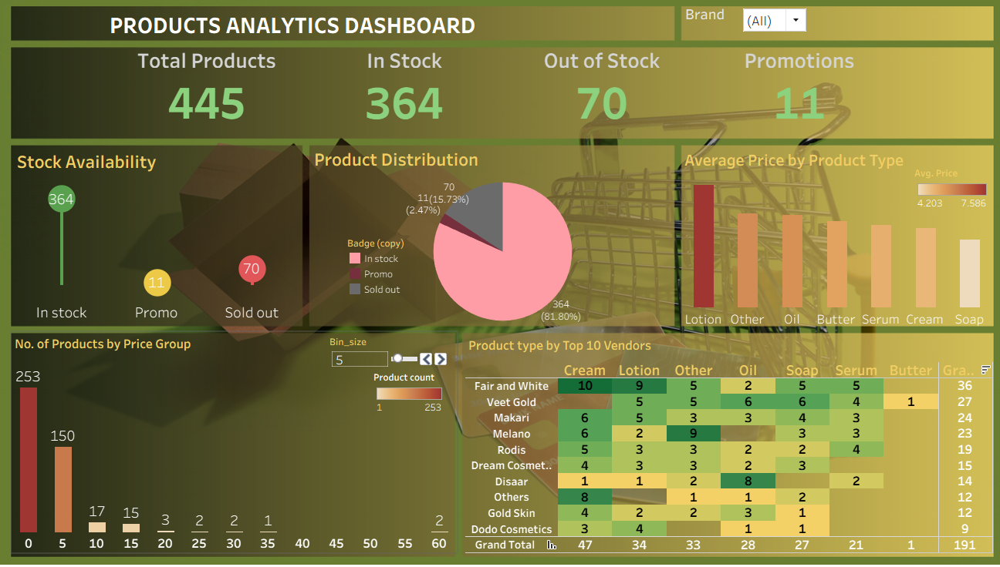

# 🧴 Skin Care Product Analysis

This project involves scraping product data from an e-commerce site, cleaning and preparing it using Python (Pandas), visualizing it using **Tableau**, and summarizing insights.

---

## 📌 Project Overview

The goal of this project is to extract and analyze product-level data from **a live e-commerce website** in order to:

- Understand price distributions  
- Track stock availability  
- Identify promotional patterns  
- Compare brand/vendor offerings

---

## 🔧 1. Web Scraping with Python

I used `requests` and `BeautifulSoup` to scrape data from a paginated product collection.

### Steps:
- Extracted all product links across pages (sorted A–Z for consistency).
- Collected key product attributes per page:
  - Name, line, vendor, availability, badge (e.g., promotion), price, image URL, and description.

### Technologies:
- `requests`
- `bs4 (BeautifulSoup)`
- `pandas`

---

## 🧼 2. Data Cleaning in Pandas

### Key Cleaning Steps:

- **Renamed Columns**  
  - Renamed `vendor` → `brand` for clarity.

- **Removed Redundant Text**  
  - Cleaned values like `"sale sale"` to `"sale"` using string normalization.

- **Handled Missing/Null Values**  
  - Dropped or imputed missing entries based on field importance.

- **Data Type Conversion**  
  - Converted `price` to float and cleaned currency symbols.

- **Outliers Handling**  
  - Investigated products priced unusually high (>60 BHD) to validate if legitimate.

- **Deduplication**  
  - Removed exact duplicates.

### Reasons for Cleaning:
- Ensure **data consistency** for accurate aggregation.
- Prepare data for smooth integration into **Tableau**.
- Enable **grouping and filtering** operations in visualizations.

---

## 📊 3. Visualization with Tableau

### Visualizations




The cleaned dataset was imported into **Tableau** for analysis.

### Key Visuals:
- **Pie Chart**: Product availability (In Stock vs Out of Stock vs On Sale)
- **Bar Chart**: Number of products by vendor/brand
- **Histogram**: Price distribution across products
- **Highlight Tables**: Promotions by brand
- **Text Table**: Average prices per product type

---

## 📝 4. Summary Findings

- **Total Products:** 445  
  - **In Stock:** 364  
  - **Out of Stock:** 70  
  - **On Promotion:** 11

- **Pricing Insights:**
  - *Lotions* are the most expensive (avg. 7.59 BHD)
  - *Soaps* are the least expensive (avg. 4.20 BHD)
  - 250 products cost less than 5 BHD
  - 2 products exceed 60 BHD

- **Top Brand: Fair and White**
  - Offers most product types (excluding butter-based)
  - 10 out of 70 products are out of stock
  - 6 products on promotion; 5 of them priced between 5–15 BHD

---

## 📁 Folder Structure

```
project/
│
├── data/
│   └── raw_scraped_data.csv
│   └── cleaned_data.csv
│
├── notebooks/
│   └── web_scraper.ipynb
│   └── data_cleaning.ipynb
│
├── tableau/
│   └── final_dashboard.twbx
│
├── summary/
│   └── insights.txt
│
└── README.md
```

---

## 🚀 Future Improvements

- Add scheduling for daily/weekly scraping  
- Include reviews or ratings (if available)  
- Monitor changes in stock and promotions over time  

---

## 🧠 Author

Built by Daniel Kofi Debrah Awuma | Powered by Python & Tableau